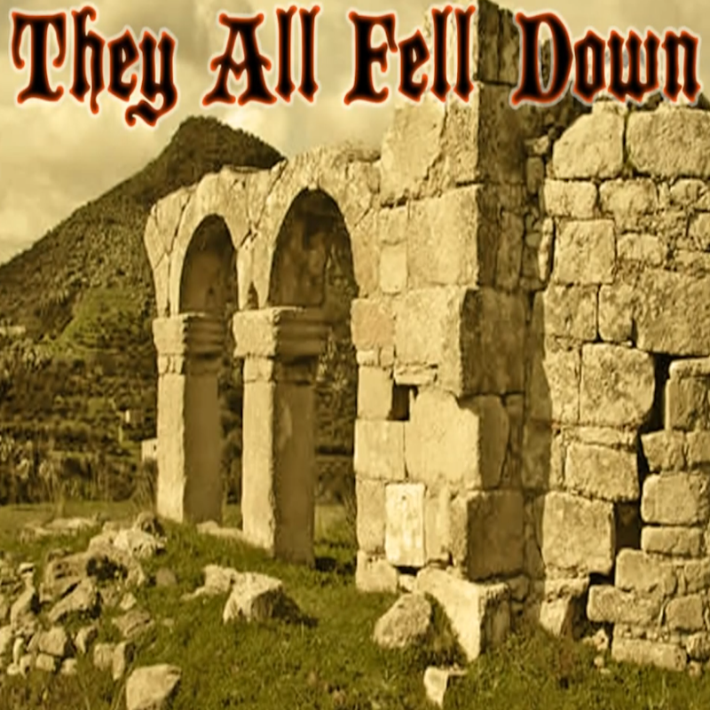

The National History Day competition is a nation wide event that challenges Middle and High School students to create a project, be it a performance, essay, documentary etc.  This is a year long project that goes from local competitions to state competitions to the final nation competition.  For this year, project topic was turning points in history.  I decided to cover the Black Plauge, and do it in a documentary form, this required making the video ten minutes long, adding in photos and voice over, and making it both interesting and informative to watch.   

Taking on this project presented me with multiple challenges, this would be the first time I ever had to make a video by myself, I had outside resources, like my parents, to offer me help, but for the most part I had to do the research, condense it down into a script, make sure said script was long enough and eventually voice it.  On top of this I decided early on that since I could not use videos or interviews from that time I had to use another method to make the documentary interesting and thus I decided to include animation.  I took old images from mideval times, and based on the parts of the script I wanted to highlight, I cut out parts of that picture in photoshop, filled in the back ground by using the stamp tool, then putting it all into an animation program where I had to key frame it and make sure it filled out the necessary time in the video.

I had to time everything perfectly, with the audio and it often time was not easy but it certainly worked out in the end.  I also decided to add music which turned out to be a challenge as it could easily drown out my voice at times, thus I had to learn how to manage audio in a video.  This was a challenging project, but certainly one I learned a lot from. I eventually got to the state competitions after beating the local competition.  I unfortunately did not make it to the national competition but I certainly learned a lot about how videos are made and learned valuable life lessons that I still follow to this day. 

To see the final product you can go here [Black Plague Documentary](https://www.youtube.com/watch?v=gPdh1PnmChw&t=6s).

