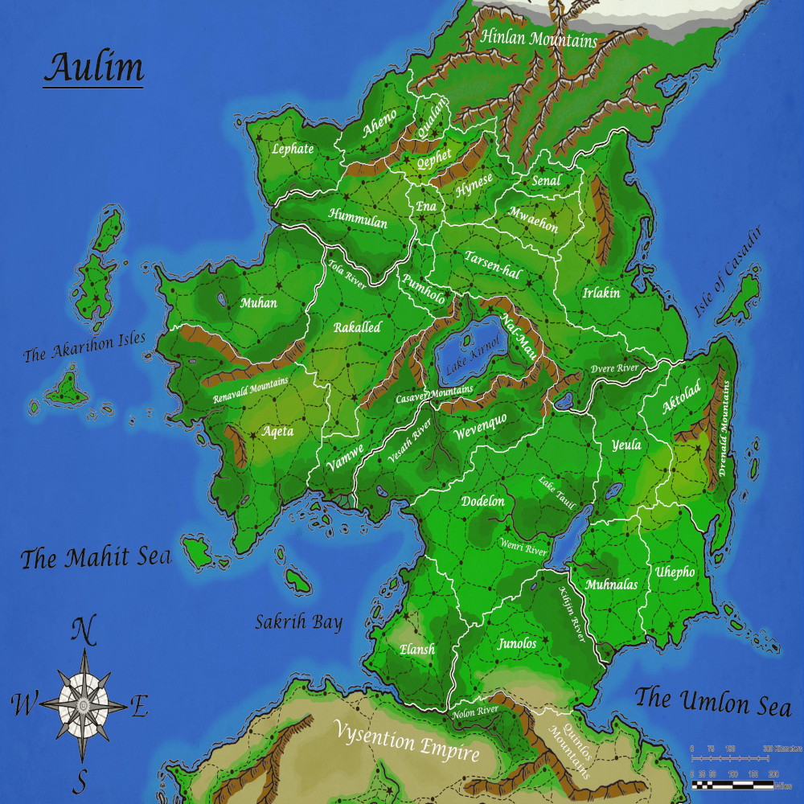

The project to make this map was one that took several years to complete as the bounds of the project expanded, hitting a multitude of stages before ending at the final product shown here. The idea of this map was to create a basic landscape of a fantasy world I created and named Aulim.  Befoe I began however, I first tried honing my skills in map making, taking on several map projects before this during which I throughly studied how continents, biomes, rivers, mountain ranges, and many of the larger aspects of a planet come to be.  With this knowledge I used refrences of the real world to craft other maps, trying my best to understand the mechanics of each map and how the land mass formed.  Finally, I began work on this map, first by drawing the coast lines while simultaneously determining how this world came to be.  I defined techtonic features and added mountains, after that I added lakes and rivers.

The first version of this map was a simple black and white map with the different regions or kingdoms marked out and named.  This suited my purposes for a while but eventually it became clearI needed a more in depth map, thus I started work on the current version shown here.  I added color, compasses, and other measuring tools, as well as cities, roads, and slight improvements to the original.  I made sure that all the environments made sense, taking into account mountain ranges and wind patters as well as the continent's location on the equator. 

I certainly learned a lot from this project, mainly in how a world is shaped and environments formed.  I also gained an appreciation for the size of our world as one of the struggles of making this map was determining the proper scale for the continent I was crafting.  I also learned a lot about digital coloring and I learned a lot that I could use to improve my art in the future.
