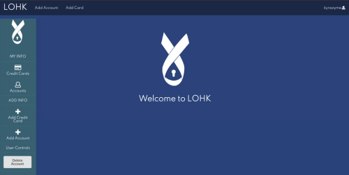

For the LOHK website, myself in a group of three other classmates, in our Software Quality Assurance course were tasked to create a secure website that could store an individual's sensitive information.  We went about this by being concious of what functions we were adding to the code, the vulnerabilities that may be present within, along with implementing provenly strong yet unobtrusive security measures, like a password or pin number.

I was a front end developer in the team, I worked primarily on the side bar which gives users the ability to create and check their passwords and creditcard information.  I also helped with smaller issues in the code, one of which ended up being a navigation bug that came from improper naming of the pages, which I promptly resolved. The other team members all contributed a lot to project and what I worked on was just a smaller part of the whole, as such, corrdination key, but due to Covid and this being an Online class, we had to tackle the issue of long distance communication and coordination. One communication issue I had to over come during the progress of this project was what exactly our project lead wanted from the side bar.  My confusion with what he wanted led to various iterations and experimentations until he helped guide me to what he wanted, at which point I could create the rest and implement it.

I found I quite enjoyed this project and the challenges it presented even if they would sometimes make things difficult to understand. Ultimately, I got more experience with React and Java Script, got some experience with front end development and wrestled with the challenges of distance communication. There is much I still would have liked to add to the project, and if I were to do this again I feel a better system of communication would be needed for a smoother work flow, but I am happy with the product we produced and the experience gained through doing it.

[The Lohker github.io](https://lohker.github.io/LOHK.github.io/)
