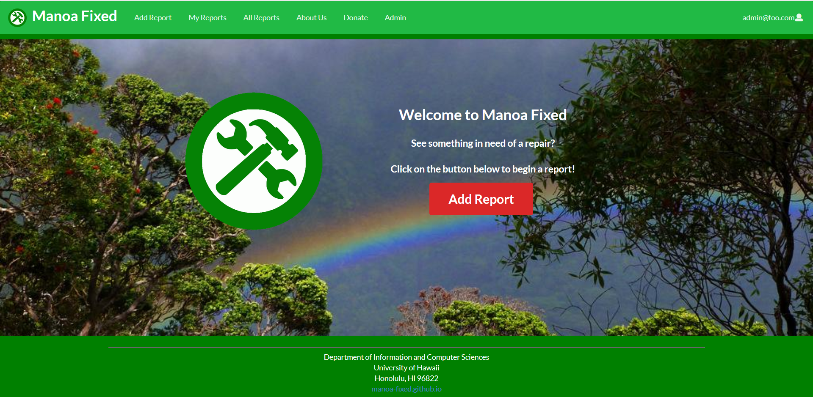

For this project I teamed up with two other members of my software engineering class to create a website as our final project for the course.  Our team leader came up with the idea to make our final project a website that people could use around campus to report damages they see around campus, such a fire damage, electronics not working as they should, or even lost items.  All the user would have to do is take a picture of the object or piece of architecture they wish to report, they add a title, state it's location, tag it, and give a brief description.  They can then post their report, after which, it will be immedeatly added to an online database and shown along a series of similar reports that users can scroll through to check if they wish.

The website is mainly ment to function as a tool maintenence workers can use to find damages around the campus with the contribution of community feedback.  As such we had to make sure that we had basic systems in place to make it as comfortable for both parties as possible.  For regular users they have full capability to edit their messages and even remove their report if they find duplicates or they made a mistake. As for the admin side, they can add reports as well, giving them the ability to edit and delete their messages just like the regular user.  However, the way an admin differs is that the admin is able to delete any message from the full list reports, not just their own.  Admins also can update the status of all the reports on the list, allowing every user to see if their report is still pending, being processed, and finally, if it had been fixed.  The website also has a few smaller features such as the ability to search for certain tags in the lists, as well as a helpful "about us" page and a "donate" page, so that esspecially charitable people can donate money to the maintenance team to support their efforts. 

My role in this project was to mainly work on the backend side of the website: I handled most of the functionality of the adding, editing, and removing of reports, implemented the ability to update status, allowed for the listing of all reports with certain privilages so not all could edit or remove reports, and finally I implemented the search feature, allowing you to look through all the reports with the relevant tag. I also made much smaller contributions to the website, such as creating the logo, implementing the report button with changing colors, and other minute details. While I am proud of how the site turned out, I do find myself wanting to change various aspects of it, mainly making the visuals appealing, allowing for images to be expanded, a more powerful search bar, and figure out some smaller issues such as the need to reupload your image when editing.  

Our Project is far from perfect, but it is my first step into this kind of coding, and it was a great way to expose myself to the complexity to creating a website, even one as seemingly simple as this. I have been left with an interest to continue exploring react and webdesign in general.  I hope to improve and increase my skill in this aspects, hopefully trying harder and harder projects, and pushing myself as I do so

The Manoa Fixed website

The Manoa Fixed git.io
