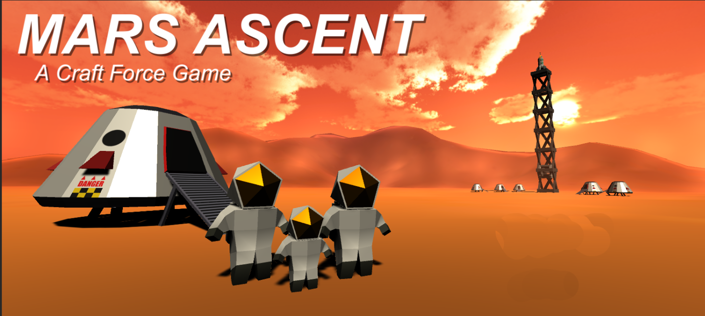
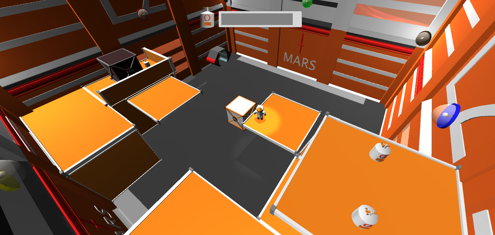
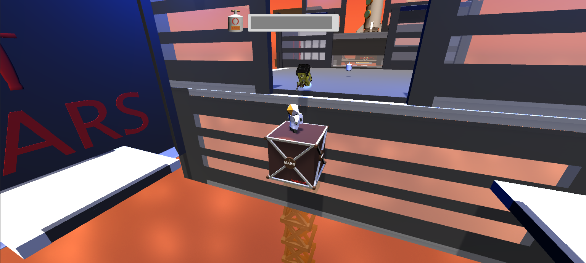

[Game Website](https://craft-force.itch.io/mars-ascent)

[Project Website](https://sites.google.com/hawaii.edu/craft-force/)

During the game design course I took in my senior year, I was assigned to a group of two other members: a fellow ICS Student and an ACM student. We were given about 2 and a half months to create a video game that would be presented to the class. We were given no parameters on what the game should be and were given complete freedom to create what we wanted. Our team first worked together creating a brainstorm for our video game, with each team member supplying an idea which we used to create a singular game concept. We then decided what needed to be done and splitthe work between us to be as balanced as possible.

The game idea we landed upon was a puzzle platformer where a Martian astronaut, following an accident with an elevator, is trying to climb the elevator shaft to reach his family before they take off in a rocketship. The gameplay is centered around trying to reach the exit of each level, usually located near the top of a level, while battling not only their oxygen supply by finding more oxygen tanks round the map, but avoiding the maintence drones that will attack the player. The core mechanic of this game however, is the ability to change the magnetism of the elevator's walls, meaning all physics objects will be pulled towards the magnetized wall. Using this mechanic, players can move boxes they otherwise would be unable to, as well as being able to ride these boxes across gaps they couldn't jump and much more. 

While working on this game I took on mutliple tasks, though I mostly focused on level and puzzle design. The other tasks I worked on were the enemy AI, button and platform scripting, the magnetism mechanic, some animations, and creating the menues. I was heavily passionate about this project, and wanted us to accomplish everything we set out to do with this game. In the end, while our game is far from perfect, specifically with camera movement, I am proud of what we achieved and what I learned. 
