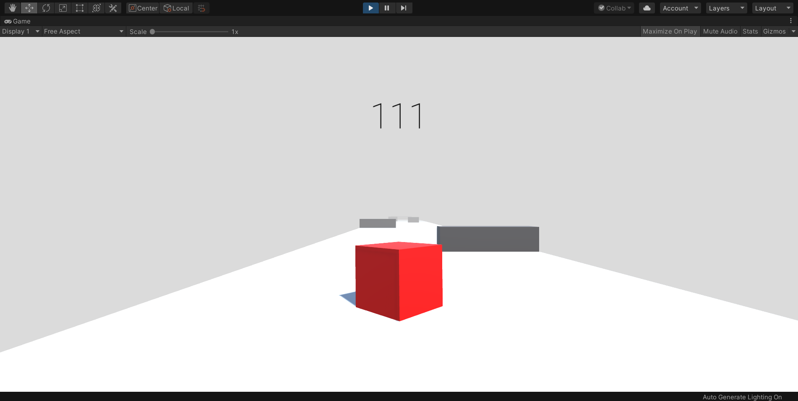

For this project I wanted to get more familiar with the Unity game engine as well as practice scripting with C#.  I used online resources to help me develop this project and help me understand how to create objects, apply physics, scripts, and much more to said objects and much more.  The goal was to create a simple game, it is comprised soley of a red cube which the player control, a large white floor, and the grey rectangles that act as obstacles for the player, with the ultimate goal of gaining the highest score in the course by going the farthest.

I have had virtually no experience with any game engine before this, so I had to learn quite a bit to understand the fundamentals; such as making objects move with forces, how I can read in user input, and how I can give objects the properties I desire.  All the scripting was done with C#, and while I felt fairly comfortable using it, the Unity Libraries posed a bit of an obstacle at first.  I was completely unaware of what was in these libraries and thus what I could do with them, or really what was even needed at the minimum.  Luckily, I was able to figure it out and progress with the creation of the game, admittedly, online tutorials helped greatly in the creation of this project. 

I never got time to properly finish the project, but as a learning exercise it has gotten me much more comfortable with Unity as a game engine as I already have plans for another fairly simplistic game which I have begun working on.  My goal is to continue to take small incremental steps, helping me to understand the engine, it's libraries, and hopefully more of the tools at my disposal.
