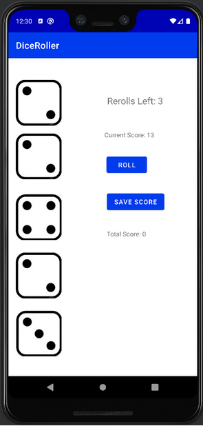

The idea of this project was to test my android development skills, creating a unique but simple app to be able to perform with multiple user inputs, save data between different states, and provide a visual that users could understand and work with. This entire project was conceptualized and made within a week, meaning I did not have time to add all the features I had wanted to implements, such as a full game experience with a main menu for the user to navigate from. Despite this, the end product has all the necessary mechanics to derive some sort of game from, which could easily be implemented if I had more time to work on it.  

The app has several features within it, most notably, the visuals of the dice, which, based on the result of a random number generator, will display five dice each with a value corresponding to the value 'rolled' by the program, as well as the sum of the dice amounts. The user is then able to either save the score of the dice rolls, or reroll the dice in hopes of a better score, however, they are limited to 3 rerolls. To assist in this process, users may select dice they do not wish to have rerolled, allowing for the best possible score over the possible rerolls. Once the score is saved or the rerolls are expended, the sum total is added to the score total, users can then roll another round of dice, adding their results to their total score.

This simple project allowed me to flex my programming skills and knowledge, starting with basic code and inefficent code before rewriting it with object oriented principles to be far cleaner and more efficent. I was also able to put into practice my newly acquired Kotlin and Android Studios expertise, saving the necessary data of the activity so that if the screen was flipped, it would update propery, carrying over all the vital information without reset itself. While I feel this project was rather minor in the grand scheme of things, it solidified a lot of my processes and experience, and in the end, I created a fully functioning app, that I could easily add more features and functionality to in the future if I so desired.
